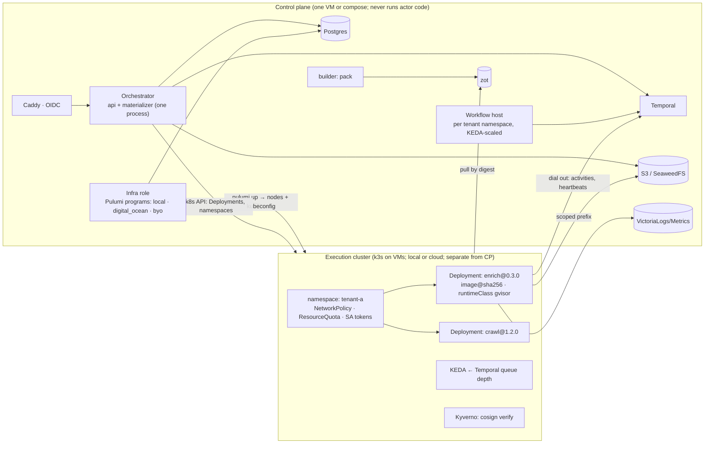

# kontra PRD: the simplified platform

**Status:** draft for review · **Owner:** Mohamed · **Date:** 2026-10-09
**Supersedes:** `kontra-hardening-spec.md` Phases 3 and 4 (Warden hardening, OpenBao), the fleet sections of `kontra-target-architecture.md`, and the "supplier/driver" discussion. Phases 0, 1, 2, 5, 6, 7 and 8 stay in force with the amendments listed in §9.

---

## 1. Summary

kontra runs user-written jobs (Actors) over batches of inputs, orchestrated by the user's own Temporal workflows, across compute the platform provisions. Today it has too many moving parts: five stores, a hand-built fleet scheduler (Warden, two fleet drivers, enrolment CA), an embedded appliance, a sidecar per actor, and three hand-maintained schema representations. Every change touches several of them.

This PRD collapses the platform to **three concepts** (Actor, Workflow, Fleet) over **three systems we do not maintain** (Temporal, Kubernetes, Pulumi), with **one owner per fact**. The author writes plain Temporal code with three small decorators; the operator picks a fleet provider by name; the platform deletes roughly 25k lines.

## 2. Goals

1. A change to kontra is a one-evening job, not a weekend. Fewer systems, one source of truth per fact, reproducible failures.
2. An author who knows Temporal reads a kontra actor without learning a framework. The only new concept is **Batch**.
3. Local development and cloud execution use the **same mechanics**: the same images, policies and placement code, differing only in which Pulumi program makes the nodes.
4. Untrusted code is isolated by components maintained by others (gVisor, Kubernetes policy), not by kontra's own agent.
5. The product shape is ready for a managed cloud: tenant isolation, metered compute, first-party modules at launch, marketplace later.

## 3. Non-goals

- Migrating off Temporal (Restate, Nomad, Windmill, Metaflow were evaluated and rejected).
- A workflow framework of our own. Workflows are plain Temporal.
- A generic data platform. Datasets stay Parquet on S3 with a DuckLake catalog.
- Opening the marketplace to third-party authors at launch.

## 4. Decisions

### D1. One owner per fact
| Fact | Owner |
|---|---|
| Execution, progress, resume | Temporal (activity heartbeat carries the checkpoint) |
| Catalog, reports, feedback, shared state | Postgres |
| Bytes: blobs, Parquet | S3 (SeaweedFS locally) |

Redis is removed if the Postgres CAS benchmark passes (hardening Phase 9 gate); otherwise it survives only for `global_state`/`object_state`, hardened. SQLite is removed. The appliance and the handler sidecar are deleted.

### D2. Actor is a thin library over a plain Temporal worker
- An actor is a Temporal activity worker plus up to three decorators: `@session` (held resource with `load`/`close`), `@batch` (per-unit commit, resume, isolation), `@contract` (schema from the function signature).
- `takes`/`emits` are removed; the signature is the contract.
- Worker tuning is **declarative, using Temporal's own option names**, in `worker.yaml` beside the code. kontra adds no aliases.
- Method calls are ordinary `execute_activity` on the actor's task queue. No Nexus hop, no backing workflow per actor.

### D3. Kubernetes is the execution plane; Pulumi makes the nodes
- Every fleet, local or cloud, is a **k3s cluster on VMs**. Pods run actor images pinned by digest under `runtimeClassName: gvisor`, with NetworkPolicy egress rules, Kyverno signature verification at admission, and projected service-account tokens as the only credentials.
- **Fleet providers are Pulumi programs** that output a kubeconfig and a node pool: `local` (Lima/Multipass VMs), `digital_ocean`, later `hetzner`, `scaleway`, and `byo-kubeconfig`. Adding a cloud is adding a program.
- The Warden, enrolment CA, egress code, both fleet drivers and the machine installer are deleted.
- KEDA scales workers on Temporal task-queue depth.
- The control plane and the execution cluster are **physically separate** (different VMs/accounts). The dev box is only ever the control plane.

### D4. Tenancy and edge
- Tenant = Temporal namespace + Kubernetes namespace (+ ResourceQuota, NetworkPolicy, per-namespace S3 prefix).
- One shared control plane; a dedicated plane is an enterprise upsell, not the default.
- Caddy is the only published service: TLS, rate limit, forward-auth to an OIDC provider for teams. The built-in admin login remains for the laptop tier.

### D5. Builds, runtimes, registry (Phase 8, unchanged)
Cloud Native Buildpacks via `pack`; run images in the public `kontra-runtimes` repo, declared by `runtime:` in `actor.json`; zot as the registry with retention and the `inuse-` reconciler; `pack rebase` for base updates; the Images page in the console.

### D6. Reports (Phase 7 + live mode)
`report.md` beside the workflow, Liquid over Markdown, rendered server-side from `run.*`, `input.*`, `result.*`, `datasets.*` summaries and `run.progress`. Live mode re-renders on in-process events (batch commit, workflow `report` query, status change) and multicasts block patches over SSE; the final render is a persisted version. No SQL in templates, no model inside kontra, no Perspective; the 15-minute completion poll is replaced by completion awaiters.

### D7. Modules repository
`kontra-actors` and `kontra-workflows` merge into **`kontra-modules`**: one folder per module holding both its actors and its workflows, versioned together, with per-folder CODEOWNERS and changed-module CI. The catalog is derived from `modules/*/module.json`.

### D8. Cloud product
- **Launch:** managed fleet only (kontra's cloud account, one project + VPC per tenant); first-party modules only; marketplace plumbing (namespaces, attribution) present but closed.
- **Later:** bring-your-own via a kubeconfig or a scoped cloud token; third-party modules with payouts.
- **Metering:** workflow-host **active** time (scale-to-zero on empty queues) plus node time. No per-event pricing.
- **Wedge:** crawling and AI data pipelines; security workflows stay first-party.

### D9. Development process
Two roles with mechanically enforced boundaries: **author** (writes modules, cannot edit core, files `blocked.md` on a core problem) and **maintainer** (fixes core from the repro, cannot edit modules). The loop is automated: `blocked.md` → labelled issue → maintainer run in CI → PR → auto-merge → author resumes from `status.md`. Humans approve `spec.md` once and read `friction.md` after.

### D10. Project hygiene
Rulesets on `main`, Renovate, CodeQL, osv-scanner, govulncheck, Trivy, gitleaks, zizmor, Scorecard, golangci-lint/ruff/Biome via lefthook, knip/deadcode/vulture monthly, GoReleaser for binaries.

## 5. Architecture



**Execution flow:** caller workflow (plain Temporal) → `fleet.hold()` (Pulumi up via Infra role, Lease workflow) → `place()` (Deployment) → `execute_activity` on the actor's queue → units commit, heartbeats carry checkpoints → records land in S3, materializer commits Parquet and emits events → report renders → scope exit deletes the Deployment; the Lease releases nodes when the last placement drops.

## 6. Author experience

```python
# modules/catalog-enrich/actors/enrich/actor.py
from temporalio import activity
from kontra import session, batch, contract, Dataset

@session                               # load/close around a held resource
class Enrich:
    async def load(self):  self.browser = await Browser.start()
    async def close(self): await self.browser.close()

    @activity.defn
    @batch(unit="product")             # per-unit commit, resume, isolation
    @contract                          # schema from the signature
    async def enrich(self, units: list[Product], out: Dataset[Enriched]) -> None:
        async for u in units:
            out.push(await self.browser.fetch(u.url))
```

```yaml
# worker.yaml — Temporal's option names, verbatim
task_queue: enrich
max_concurrent_activities: 2
max_concurrent_activity_task_pollers: 2
graceful_shutdown_timeout: 30s
```

```json
// actor.json
{ "name": "enrich", "version": "0.3.0", "runtime": "python-browser:1",
  "resources": { "memory": "1Gi", "cpus": 1 } }
```

```python
# modules/catalog-enrich/workflows/enrich-all/workflow.py — plain Temporal
@workflow.defn
class EnrichAll:
    @workflow.query(name="report")
    def report(self): return self._partial

    @workflow.run
    async def run(self, catalog: str) -> EnrichResult:
        async with fleet.hold(size="m", nodes=4) as f:
            await f.place("enrich", replicas=8)
            await f.ready()
            async for b in products.batches(500):
                await workflow.execute_activity("enrich", b, task_queue="enrich", ...)
        return EnrichResult(...)
```

`report.md` (Liquid) sits beside `workflow.py`. `kontra workflow serve` lints the template and the worker spec before anything runs.

## 7. Operator experience

```yaml
# kontra.yaml
fleet:
  provider: digital_ocean        # local | digital_ocean | hetzner | scaleway | byo-kubeconfig
  region: fra1
  sizes: { s: s-2vcpu-4gb, m: s-4vcpu-8gb, l: s-8vcpu-16gb }
  idle_minutes: 15               # keep nodes warm after the last lease
```

- **Install:** `docker compose up -d --wait` for the control plane (release), `scripts/dev-setup.sh` for contributors, GoReleaser binaries for the CLI. Nothing else.
- **Local fleet:** `kontra fleet local --nodes 1` makes one VM with k3s; `--nodes 3` makes three for fleet tests. Same images, same policies as the cloud.
- **Observability:** one trace per run (OTEL), the Images page, the Fleet page (nodes, placements, leases).

## 8. Deletions

| Component | Lines (approx.) | Replaced by |
|---|---|---|
| `cli/appliance/` + installers | 13,400 | compose + GoReleaser |
| `runtime/handler/` sidecar | 7,500 | in-process worker |
| Warden, enrolment CA, egress, two fleet drivers, `machine.ts` | ~9,000 | Kubernetes + gVisor + Kyverno + NetworkPolicy |
| Redis adapters, SQLite store | 1,500 | Postgres |
| Dockerfile generation in `deploy.go` | 1,100 | `pack` |
| Meta-tests (wording, retired words) | 1,000 | behavioural tests |
| Hand-written wire types ×3 | — | generated from proto |

## 9. Sequencing and amendments

| Order | Work | Depends on | Amends |
|---|---|---|---|
| 1 | Hardening Phase 0 (auth, workbench, binds) | — | — |
| 2 | Phase 1 (heartbeat checkpoints, idempotent writes) + Phase 9 store collapse (Postgres, Redis gate) | 1 | Phase 1 §5 |
| 3 | Phase 2 (in-process worker) + D2 decorators, `worker.yaml`, remove `takes`/`emits` | 2 | — |
| 4 | Phase 5 (delete appliance, GoReleaser) + D10 hygiene | — | — |
| 5 | **D3 Kubernetes fleet**: `local` and `digital_ocean` providers, Deployments, gVisor/Kyverno/NetworkPolicy, KEDA, Lease on node pools; delete Warden and drivers | 3, 4 | **Replaces Phases 3 and 4** |
| 6 | Phase 8 (buildpacks, runtimes, zot, Images page) | 5 (images must run on k8s) | registry creds via SA tokens |
| 7 | Phase 7 + live mode (reports) | 2, 6 | store = Postgres; no Redis |
| 8 | D7 modules repo migration | 3 | — |
| 9 | D4 edge (Caddy, OIDC), D8 cloud tenancy and metering | 5, 7 | — |
| 10 | D9 automated author/maintainer loop | 4 | — |

**PR 24 (Phase 8 branch) is paused** until step 5 lands; its buildpack code is kept, its appliance edits are reverted, and it rebases onto the k8s fleet.

## 10. Acceptance (whole PRD)

1. A new contributor runs `docker compose up`, `kontra fleet local --nodes 1`, and the seeded module end to end in under 15 minutes on a laptop.
2. The same module runs unchanged with `provider: digital_ocean`; only `kontra.yaml` differs.
3. Killing a worker pod mid-batch resumes from the last committed unit with no duplicate rows; killing a node reschedules the pod; the Lease releases nodes when the last placement ends. All three are CI tests on the local provider with `--nodes 3`.
4. A pod cannot reach another tenant's S3 prefix, Temporal namespace, or pods; cannot reach the control plane's Postgres; cannot run an unsigned image. Tested.
5. `rg -l "warden|appliance|redis"` over non-doc source returns nothing (Redis only if the gate failed).
6. A Temporal-literate reviewer reads `enrich/actor.py` and names Batch as the only unfamiliar concept.
7. Every acceptance test from Phases 0, 1, 2, 5, 7, 8 that is not superseded still passes.

## 11. Open questions

1. k3s on droplets vs managed DOKS for the cloud provider program (DOKS = less to run; k3s = identical to local). Default: k3s first, DOKS as a second program if operations demand it.
2. Nested virtualization on CI runners for the local provider's fleet tests (Linux runners: yes; macOS: no). Confirm before step 5.
3. Redis gate outcome (step 2) decides whether `global_state` lives in Postgres.
4. Whether the first-boot local provider should pre-pull runtime images into the VM image to keep "15 minutes" true offline.

## 12. Glossary (final)

| Term | Meaning |
|---|---|
| **Actor** | A Temporal activity worker using the kontra decorators; packaged as an image |
| **Method** | An activity on an actor; receives a Batch and an output Dataset |
| **Batch / Unit** | The work and one item of it; units commit individually and resume |
| **Dataset** | Parquet on S3, SQL-queryable, readable while a run is open |
| **Workflow / Run** | The user's plain Temporal workflow and one execution of it |
| **Fleet** | A node pool made by a provider's Pulumi program; a k3s cluster or part of one |
| **Placement** | A Deployment of an actor image on a fleet |
| **Lease** | A run's claim on a fleet; nodes are released when the last lease drops |
| **Module** | A folder of actors and workflows versioned together |
| **Report** | The run's `report.md` rendered live and frozen at completion |

Retired: Machine, Warden, Driver, Container (as author-facing terms), Pane, Wall, Scratch, Pulse.
