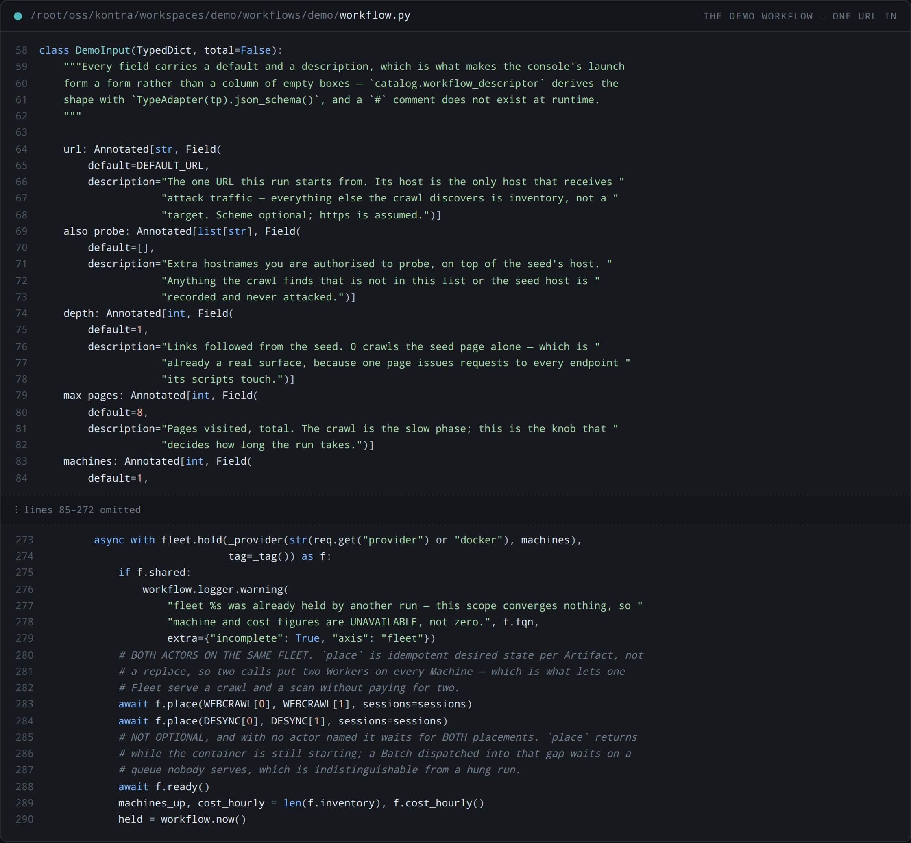
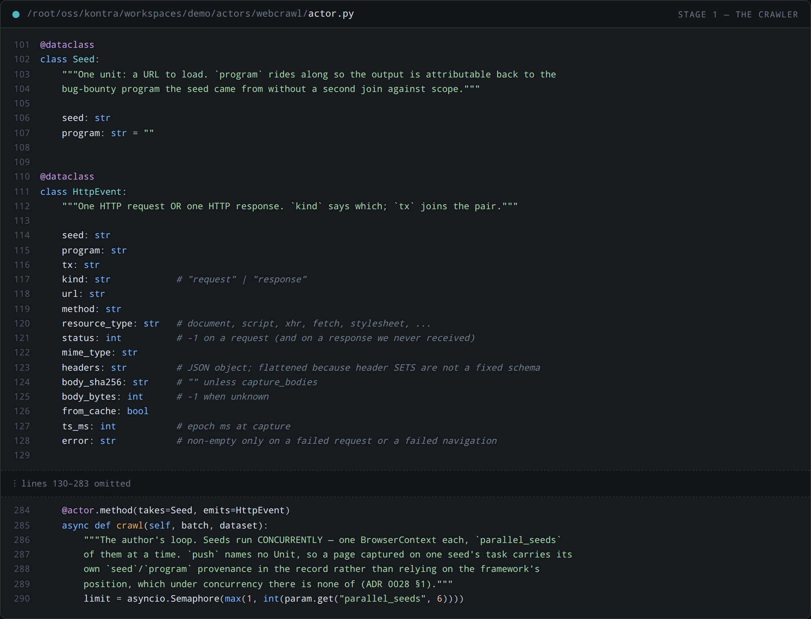
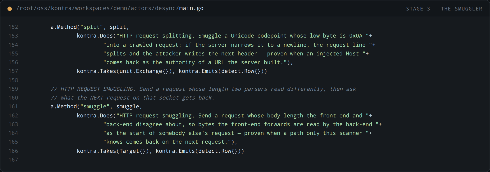
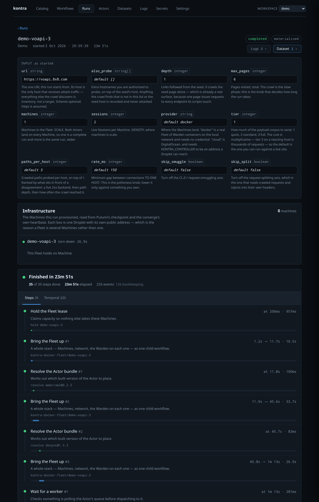
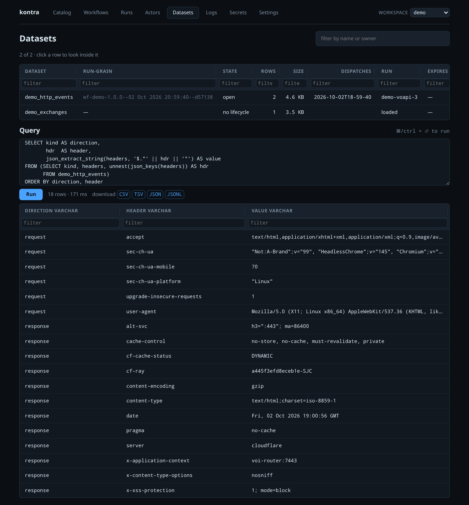
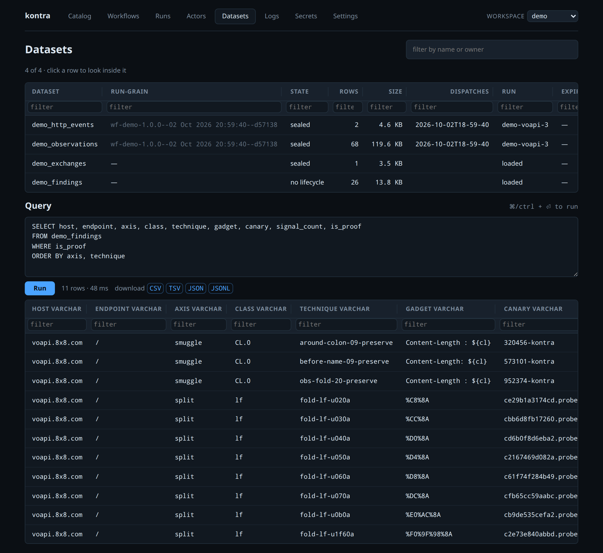

# workspaces/demo

**One URL in, desync findings out.**

This is the worked example: a single workflow that crawls a URL, folds the captured traffic into
replayable request/response pairs, probes them for HTTP request smuggling and request splitting,
and leaves four queryable Datasets behind.

It exists because the `hunt` workflow it is distilled from takes a *program name* and reads a scope
Dataset somebody loaded first — correct at campaign scale, and a wall if you just want to see the
thing work once. Here the entire input is a URL.

```
url  ──▶  webcrawl.crawl   ──▶  demo_http_events     one row per request OR response
                │
                └── SQL fold on `tx` ──▶  demo_exchanges      request+response pairs
                                               │
         desync.smuggle  ◀── targets ──────────┤
         desync.split    ◀── exchanges ────────┘
                │
                └──▶  demo_observations  ──  WHERE ──▶  demo_findings
```

---

## What it looks like

Every image below is a capture of this workspace running against `https://voapi.8x8.com` — the run
is `demo-voapi-3`, and the numbers in the captions are that run's.

### The workflow: one URL in



`url` is the whole input. `also_probe` is the authorisation boundary. Below it, capacity first and
work second: `place` twice puts both Actors on every Machine, and `ready()` is not optional because
`place` returns while the container is still starting.

### The two Actors





`split` takes a crawled **Exchange**, so its injection points are the headers this host actually
reads. `smuggle` takes a **Target**, a door to knock on, because a length disagreement is a property
of the two parsers in front of a host rather than of any one request.

### The run



35 of 35 steps in 23m 51s. The Fleet reports **0 machines because it has already been destroyed** —
the Lease dropped when the scope exited, which is the property a shell script cannot give you.

### Where to inject



The **request** headers are what the splitting axis injects into. The **response** headers name
**two different parsers on one connection**, which is the precondition for everything here:
`server: cloudflare` in front, and `x-application-context: voi-router:7443` — the back end naming
itself. The page answered `403`; a host that refuses a browser still answers a scanner.

### What was proven



Eleven proofs, answered in 48 ms over data already on disk. Three are `CL.0`, where whitespace hides
a second `Content-Length` from one parser and not the other — a tab before the name, tabs around the
colon, and an obs-fold. Eight are the splitting axis finding **codepoints whose low byte is `0x0A`**,
which a lossy narrowing turns into a newline — up to `U+1F60A`, an emoji.

---

## Run it

```sh
kontra workspace use demo

# Serve the workflow. The queue is derived from the folder — there is no --queue flag.
kontra workflow serve workspaces/demo/workflows/demo

# Start a run. Every field has a default, so this alone is a complete run.
kontra workflow start workspaces/demo/workflows/demo --id demo-1

# Or aim it somewhere:
kontra workflow start workspaces/demo/workflows/demo --id demo-2 \
  --input '{"url": "https://example.com", "max_pages": 10, "tier": 2}'
```

Stop one with `kontra workflow cancel <run-id>` — **never `terminate`**: cancel runs the scope
exits, so the Fleet is destroyed. Terminate skips them and a cloud Fleet would keep billing.

### If `/api/datasets` answers 502 the first time

Each workspace gets its **own** DuckLake catalog — a separate Postgres database, so two workspaces
cannot corrupt each other's `ducklake_*` metadata tables. Nothing creates that database yet: a
workspace that was never provisioned fails its first Dataset read with

```
IO Error: Failed to attach DuckLake MetaData … database "kontra_ducklake_ws_demo" does not exist
```

Create it once, and only it — an **empty** database. DuckLake builds its own tables on attach, and
hand-editing those tables is never the answer:

```sh
docker exec kontra-postgres psql -U kontra -d postgres -c 'CREATE DATABASE kontra_ducklake_ws_demo;'
```

The name is `kontra_ducklake_ws_<workspace>` with hyphens turned into underscores — which is why a
workspace name may not contain an underscore of its own (see `cli/workspace.go`).

---

## Authorisation — read this before you point it anywhere

**This workflow sends attack traffic.** Request smuggling probes deliberately desynchronise a
connection between a front-end and a back-end; request splitting injects control characters into
headers a server will parse.

A crawl of one page pulls in whatever that page loads — CDNs, analytics, consent widgets, payment
iframes. Those hosts belong to other people and are almost never in anybody's authorisation. So:

> **The probe scope is the seed URL's host and nothing else.** Every other host the crawl
> discovers is recorded as inventory and never receives a single attack request.

Widening it is opt-in and explicit:

```json
{"url": "https://voapi.8x8.com", "also_probe": ["api.8x8.com"]}
```

Only put a host in `also_probe` that you are authorised to test.

---

## The input

| field | default | what it decides |
|---|---|---|
| `url` | `https://voapi.8x8.com` | the one URL the run starts from; its host is the only host probed |
| `also_probe` | `[]` | extra hostnames you are authorised to probe |
| `depth` | `1` | links followed from the seed; `0` is the seed page alone |
| `max_pages` | `8` | pages visited total — the knob that decides how long the run takes |
| `machines` | `1` | Machines in the Fleet. SCALE |
| `sessions` | `2` | live Sessions per Machine. DENSITY |
| `provider` | `docker` | `docker` needs no credential; `cloud` is DigitalOcean |
| `tier` | `1` | how much of the payload corpus to send. 1 quick, 2 standard, 3 full |
| `paths_per_host` | `5` | crawled paths probed per host, on top of `/` |
| `rate_ms` | `150` | minimum gap between connections **to one host** — the politeness knob |
| `skip_smuggle` | `false` | turn off the CL.0 axis |
| `skip_split` | `false` | turn off the splitting axis |

`depth: 0` is already a real surface. One modern page issues requests to every endpoint its
scripts touch, and those requests carry the headers the host *actually reads* — which is what no
static wordlist knows.

---

## The four Datasets

Names are fixed rather than suffixed per target: the host is a column (`program` / `target`) on
every row, and "show me every finding this demo ever produced" should be a `SELECT`, not a `UNION`
over one table per URL somebody typed.

| Dataset | one row is | written by |
|---|---|---|
| `demo_http_events` | one HTTP request **or** one response; `tx` joins the pair | `webcrawl.crawl` |
| `demo_exchanges` | one replayable request+response pair | the SQL fold |
| `demo_observations` | one (point, vector) probe — **evidence, not a verdict** | `desync.smuggle` / `desync.split` |
| `demo_findings` | one promoted lead, with `is_proof` computed | the promote step |

### Where to inject — the response headers

```sql
SELECT DISTINCT ON (host) host, status,
       json_extract_string(headers, '$.server') AS back_end,
       json_extract_string(headers, '$.via')    AS front_end_via,
       json_extract_string(headers, '$.vary')   AS vary_cache_key,
       headers
FROM (SELECT regexp_extract(url, 'https?://([^/]+)', 1) AS host, status, headers
      FROM demo_http_events WHERE kind = 'response')
ORDER BY host;
```

`via` names the front-end, `server` names the back-end behind it. **Two parsers visible in one
row** is the precondition for every technique here — desync lives exactly where two of them
disagree.

### What was proven

```sql
SELECT host, endpoint, axis, technique, gadget, canary, signal_count, is_proof, status
FROM demo_findings
WHERE is_proof
ORDER BY host, technique;
```

`is_proof` takes **three** signals, not two. `authority_injected` and `canary_reflected` each mean
a value this scanner minted came back where no innocent path puts it — but a server that pipelines
reflects a canary for a reason that has nothing to do with the gadget and is not a vulnerability.
`control_survived` means the Actor re-ran the identical request well-formed and the behaviour did
**not** reproduce. Without it, `is_proof` can be true of a row nobody controlled.

Every finding carries both requests twice: as readable HTTP, and as `_b64` of the wire bytes. A
desync payload is made of exactly the bytes a clipboard destroys, so the readable form would
arrive with its bug normalised out and reproduce nothing — `base64 -d` the `_b64` column and paste
that into a replay tool.

---

## The two Actors

Both are copies of the ones the methodology report is written about, pinned to the versions the
workflow resolves against.

| Actor | language | the Unit it takes | why |
|---|---|---|---|
| `webcrawl@0.2.3` | Python | a `Seed` — one URL | one BrowserContext per seed: its own cookie jar, storage and cache |
| `desync@1.3.3` | Go | `split` takes an **Exchange**, `smuggle` takes a **Target** | see below |

**That difference is the whole design.** `smuggle` asks what the two parsers in front of a host do
with a body length — a property of the host and the path, so its Unit is a door to knock on.
`split` injects into the header block the browser *actually sent*, so its Unit is a crawled
exchange and its injection points are the headers this host reads rather than ones a wordlist
guessed.

Both emit the same `detect.Row` into one Dataset, because an observation is an observation — the
axis is a column. Classification happens afterwards in SQL, which is what makes a detection
improvement cost a query rather than another pass over somebody else's network.

---

**See also:** the project wiki — `Writing-Workflows`, `Execution-Model`, `Glossary`.
